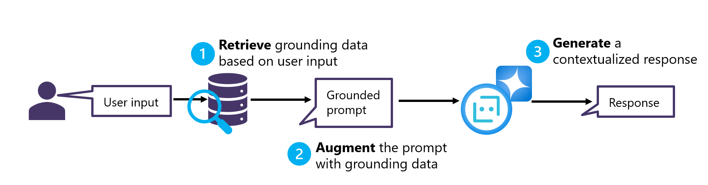

# Exploring RAG pattern for LLMs

**Retrieval Augmented Generation (RAG)** is the pattern or architectural design enabling data management of custom business data in a db, real-time data retrieval to efficiently extract information from the db which are relevant to the user query, and LLM prompt augmentation with the search result.

The way it works is:
- The user inputs an initial prompt, which is used to search a data source and **retrieve** relevant grounding data.
- The grounding data is used to **augment** the prompt by adding additional contextualization and scoping text.
- The augmented prompt is submitted to the LLM, which can then **generate** an appropriate response in natural language.

## About this repo
This repository contains a collection of notebooks and scripts that break down the RAG pattern for LLMs. It is organized as follows:
1. [0-create-search-index.ipynb](./0-create-search-index.ipynb): this notebook demonstrates how to *create a search index* with **Azure AI Search** using an hybrid search approach + semantic ranking. It populates the index with a sample dataset containing a product catalog ([products.csv](./data/products.csv)) of a fictional retail company called Contoso.
2. [1-retrieve-documentation.ipynb](./1-retrieve-documentation.ipynb): this notebook demonstrates how to *retrieve relevant documentation* from the Azure AI search index using a user query. To do so, it first converts the query into an embedding, using Azure OpenAI text-embedding-ada-002 model.
3. [2-augment-prompt.prompty](./2-augment-prompt.prompty): this script demonstrates how to *build a dynamic prompt specification* with **Prompty** and inform it with the retrieved documentation. The Prompty file can also be executed to *generate the final answer* to the augmented prompt.

## Pre-requisites

To get started with this sample, you will need:
* [Azure Subscription](https://azure.microsoft.com/free/) - sign up for a free account.
* [GitHub Account](https://github.com/signup) - sign up for a free account.
* [Access to Azure OpenAI](https://learn.microsoft.com/legal/cognitive-services/openai/limited-access) - submit form to request access.

Also, you'll need to provision the following Azure resources:
* An [Azure AI Search](https://docs.microsoft.com/azure/search/search-create-service-portal) service.
* An [Azure OpenAI Service](https://learn.microsoft.com/en-us/azure/ai-services/openai/how-to/create-resource?pivots=web-portal) resource and two model deployments:
    - name: `embedding-ada`, type: `text-embedding-ada-002`, version: `default`
    - name: `gpt-4-turbo`, type: `gpt-4`, version: `turbo-2024-04-09`

## Run in GitHub Codespaces
We recommend using GitHub Codespaces for the fastest start with least effort. In fact, by creating a Codespace, you can run the notebooks and scripts in this repository without having to install anything on your local machine, since all the pre-requisites are specified in the dev container configuration file ([.devcontainer/devcontainer.json](./.devcontainer/devcontainer.json)).

Click the button to launch this repository in GitHub Codespaces.
  

 This opens a new browser tab with setup taking a few minutes to complete. Once ready, you should see a Visual Studio Code editor in your browser tab, with a terminal open. You can also open your Codespaces from within your Visual Studio Code desktop application.